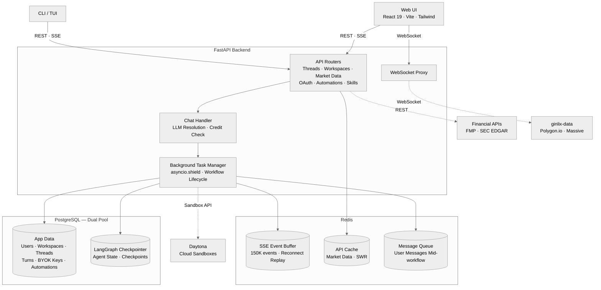
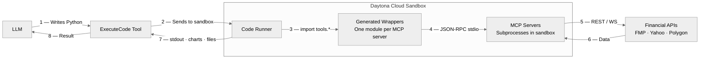
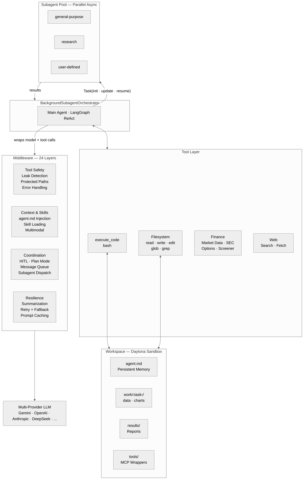

<p align="center">
  
  <br>
  <strong>A vibe investing agent harness</strong>
  <br>
  LangAlpha is built to help interpret financial markets and support investment decisions.
  <br><br>
  
  <a href="https://github.com/langchain-ai/langchain"></a>
  
</p>

> [!NOTE]
> **Gemini 3 Hackathon** — If you're a judge or reviewer for the [Gemini 3 Hackathon](https://gemini3.devpost.com/), please refer to the [`hackathon/gemini-3`](https://github.com/ginlix-ai/stealth-agent/tree/hackathon/gemini-3) branch for the frozen submission. This `main` branch contains ongoing development beyond the submission.

---

<p align="center">
  <a href="#getting-started">Getting Started</a> &bull;
  <a href="docs/api/README.md">API Docs</a> &bull;
  <a href="src/ptc_agent/">Agent Core</a> &bull;
  <a href="src/server/">Backend</a> &bull;
  <a href="web/">Web</a> &bull;
  <a href="libs/ptc-cli/">TUI</a> &bull;
  <a href="skills/">Skills</a> &bull;
  <a href="mcp_servers/">MCP</a>
</p>

## Why LangAlpha
Every AI finance tool today treats investing as one-shot: ask a question, get an answer, move on. But real investing is Bayesian — you start with a thesis, new data arrives daily, and you update your conviction accordingly. It's an iterative process that unfolds over weeks and months: refining theses, revisiting positions, layering new analysis on top of old. No single prompt captures that.

### *From vibe coding to vibe investing*
Inspired by software engineering: a codebase persists, and every commit builds on what came before. Code agent harnesses like Claude Code and OpenCode succeeded by building agents that embrace this pattern, exploring existing context and building on prior work. LangAlpha brings that same insight: give the agent a persistent workspace, and research naturally compounds.

In practice, you create a workspace per research goal ("Q2 rebalance", "data center demand deep dive", "energy sector rotation"). The agent interviews you about your goals and style, produces its first deliverable, and saves everything to the workspace filesystem. Come back tomorrow and your files, threads, and accumulated research are still there.

## What Powers It

<details open>
<summary><b>System Architecture</b></summary>
<br/>



</details>

### Multi-Provider Model Layer

LangAlpha runs on a provider-agnostic model layer that abstracts across multiple LLM backends. The same middleware stack, tools, and workflows work regardless of which model is driving them. It ships with two modes:

- **PTC mode** for deep, multi-step investment research. Strong reasoning drives multi-step analysis where the agent plans its approach, thinks through financial data, and writes code for complex analysis. Long context lets it cross-reference SEC filings and research reports in a single pass.
- **Flash mode** for fast conversational responses: quick market lookups, chart-and-chat in MarketView, and lightweight Q&A without spinning up a full workspace.

**Bring your own model** — Use your existing AI subscriptions and API keys directly. Connect ChatGPT or Claude subscriptions via OAuth (OpenAI Codex OAuth, Claude Code OAuth), use coding plans from Kimi (Moonshot), GLM (Zhipu), or MiniMax, or supply your own API keys for any supported provider via BYOK. All keys are encrypted at rest via PostgreSQL pgcrypto (see [Security](#security)).

**Model resilience** — 3 retries with exponential backoff on the same model, then automatic failover to a configured fallback model. Reasoning effort (`low`/`medium`/`high`) is normalized across providers automatically.

### Programmatic Tool Calling (PTC) and Workspace Architecture

Most AI agents interact with data through one-off JSON tool calls which dump the result into the context window directly. Programmatic Tool Calling flips this: instead of passing raw data through the LLM, the agent writes and executes code inside a [Daytona](https://www.daytona.io/) cloud sandbox that processes data locally and returns only the final result. This dramatically reduces token waste while enabling analysis that would otherwise exceed context limits.

<details open>
<summary><b>PTC Execution Flow</b></summary>
<br/>



</details>

In addition, the workspace environment enables persistence beyond a single session. Each sandbox has a structured directory layout — `work/<task>/` for per-task working areas (data, charts, code), `results/` for finalized reports, and `data/` for shared datasets — so intermediate results survive across sessions. At the root sits `agent.md`, a persistent memory file that the agent maintains across threads: workspace goals, key findings, a thread index, and a file index of important artifacts. A middleware layer injects `agent.md` into every model call, so the agent always has full context of prior work without re-reading files. Each workspace supports multiple conversation threads tied to a single research goal.

### Financial Data Ecosystem

While PTC excels at complex work like multi-step data processing, financial modeling, and chart creation, spinning up code execution for every data lookup is overkill. So we also built a native financial data toolset that transforms frequently used data into an LLM-digestible format. These tools also come with artifacts that render directly in the frontend, giving the human layer immediate visual context alongside the agent's analysis.

**Native tools** for quick reference via direct tool calls:
- **Company overview** with real-time quotes, price performance, key financial metrics, analyst consensus, and revenue breakdown
- **SEC filings** (10-K, 10-Q, 8-K) with earnings call transcripts and formatted markdown for citation
- **Market indices** and **sector performance** for broad market context
- **Web search** (Tavily, Serper, Bocha) and **web crawling** with circuit breaker fault tolerance

**MCP servers** for raw data consumed through PTC code execution:
- **Price data** for OHLCV time series across stocks, commodities, crypto, and forex
- **Fundamentals** for multi-year financial statements, ratios, growth metrics, and valuation
- **Macro economics** for GDP, CPI, unemployment, Fed funds rate, treasury yield curve (1M–30Y), country risk premiums, economic calendar, and earnings calendar
- **Options** for options chain with filtering, historical OHLCV for option contracts, and real-time bid/ask snapshots
- **Yahoo Finance** for options chains, institutional holdings, insider transactions, ESG data, and cross-company comparisons

The agent picks the right layer automatically: native tools for fast lookups that fit in context, MCP servers when the task requires bulk data processing, charting, or multi-year trend analysis in the sandbox.

> [!NOTE]
>Most native tools and MCP servers use [Financial Modeling Prep](https://site.financialmodelingprep.com/) as the data provider (`FMP_API_KEY` required).

### Financial Research Skills

The agent ships with 23 pre-built financial research skills, each activatable by slash command or automatic detection. Skills follow the [Agent Skills Spec](https://agentskills.io/specification) and can be extended by dropping a `SKILL.md` file into the workspace.

| Category | Skills |
|---|---|
| **Valuation & Modeling** | DCF Model, Comps Analysis, 3-Statement Model, Model Update, Model Audit |
| **Equity Research** | Initiating Coverage (30–50pg report), Earnings Preview, Earnings Analysis, Thesis Tracker |
| **Market Intelligence** | Morning Note, Catalyst Calendar, Sector Overview, Competitive Analysis, Idea Generation |
| **Document Generation** | PDF, DOCX, PPTX, XLSX — create, edit, extract |
| **Operations** | Investment Deck QC, Scheduled Automations, User Profile & Portfolio |

Acknowledgement: some of skills are adapted from [anthropics/financial-services-plugins](https://github.com/anthropics/financial-services-plugins).

### Multimodal Intelligence

The agent natively reads images (PNG, JPG, GIF, WebP) and PDFs — the multimodal middleware intercepts file reads, downloads content from the sandbox or URLs, and injects it as base64 into the conversation for direct visual interpretation. In MarketView, the user's live candlestick chart can be captured and sent to the agent as multimodal context — the capture includes both the chart image and structured metadata (symbol, interval, OHLCV, moving averages, RSI, 52-week range) so the agent can reason about both the visual pattern and the underlying data.

### Scheduled Automations

The agent can schedule its own recurring tasks from within a conversation. Say "run this analysis every Monday at 9 AM" and the agent creates a cron-based automation that executes on schedule — no separate UI needed. Automations support standard cron expressions and one-shot datetime scheduling, configurable agent mode (PTC or Flash), and automatic disabling after consecutive failures. Users can also manage automations from the dedicated Automations page with full CRUD, execution history, and manual trigger.

<details open>
<summary><b>Agent Architecture</b></summary>
<br/>



</details>

### Agent Swarm

The core agent runs on [LangGraph](https://github.com/langchain-ai/langgraph) and spawns parallel async subagents via a `Task()` tool. Subagents execute concurrently with isolated context windows, preventing drift in long reasoning chains. Each subagent returns synthesized results back to the main agent, keeping the orchestrator lean. The main agent can choose to wait for a subagent's result or continue other pending work. Interrupting the main agent does not stop running subagents, so you can halt the orchestrator, update your requirements, or dispatch additional subagents while existing ones finish in the background. You can also switch to the **Subagents** view in the UI to see their progress in real time (web frontend only).

Beyond simple dispatch, the main agent can send follow-up instructions to a still-running subagent via `Task(action="update")`, or resume a completed subagent with full checkpoint context via `Task(action="resume")` for iterative refinement. If the server restarts, subagent state is automatically reconstructed from LangGraph checkpoints.

### Middleware Stack

The agent ships with a middleware stack, including:
- **Dynamic skill loading** via a `LoadSkill` tool that lets the agent discover and activate skill toolsets on demand, keeping the default tool surface lean while making specialized capabilities available when needed
- **Multimodal** intercepts file reads for images and PDFs, downloads content from the sandbox or URLs, and injects it as base64 into the conversation so multimodal models can interpret them natively
- **Plan mode** with human-in-the-loop interrupts lets you review and approve the agent's strategy before execution
- **Auto-summarization** compresses conversation history when approaching token limits, preserving key context while freeing space
- **Context management** automatically offloads tool results exceeding 40,000 tokens to the workspace filesystem, keeping a truncated preview in context. For very long sessions, a two-tier summarization system first truncates old tool arguments, then LLM-summarizes the conversation history while offloading the full transcript to the workspace for recovery. Research sessions can run indefinitely without hitting token limits.

See [`src/ptc_agent/agent/middleware/`](src/ptc_agent/agent/middleware/) for the full set.

Acknowledgement: some of middleware components are adapted or inspired by the implementation in [LangChain DeepAgents](https://github.com/langchain-ai/deepagents).


### Streaming and Infrastructure

The server streams all agent activity over SSE: text chunks, tool calls with arguments and results, subagent status updates, file operation artifacts, and human-in-the-loop interrupts. Every agent decision is fully traceable in the UI.

Workflows run as independent background tasks behind `asyncio.shield()`, fully decoupled from the HTTP/SSE connection. If the browser tab closes or the network drops, the agent keeps working. On reconnect, up to 150,000 buffered events replay from Redis with `last_event_id` deduplication, picking up exactly where the client left off. A background cleanup task auto-purges abandoned workflows after one hour. Soft interrupts pause the main agent while background subagents continue running.

PostgreSQL backs LangGraph checkpointing, conversation history, and user data (watchlists, portfolios, preferences), so agent state and user context persist across sessions. Redis buffers SSE events so that browser refreshes and network drops do not lose in-flight messages: the client reconnects and replays automatically. The server also handles synchronization between local data and sandbox data, keeping MCP, skills, and user context in sync. See the full [API reference](docs/api/README.md) for details.

## Security

### Credential Leak Detection

Every tool output is scanned before it reaches the LLM context. The middleware resolves all API key values from MCP server configurations, sorts them by length to prevent partial-match issues, and redacts any match as `[REDACTED:KEY_NAME]`. A regex pattern additionally catches dynamically refreshed sandbox tokens that weren't in the original configuration. API keys never appear in the agent's reasoning or in logged conversations, even if a tool accidentally echoes them.

### BYOK Encryption at Rest

User-supplied API keys are encrypted inside PostgreSQL using the `pgcrypto` extension (`pgp_sym_encrypt` / `pgp_sym_decrypt`). Encryption and decryption happen at the database layer — plaintext keys never exist in application memory during persistence. The same pattern covers OAuth tokens (access + refresh).

### Sandboxed Code Execution

Code execution is double-isolated. At the infrastructure level, each workspace runs in its own [Daytona](https://www.daytona.io/) cloud sandbox with a dedicated filesystem and network boundary. At the agent level, the middleware stack adds a second layer: credential leak detection scans all outputs, and protected path guards prevent the agent from accessing internal system directories — blocking both tool input (short-circuiting the call before execution) and tool output (redacting leaked paths).

## Frontend

The web UI is more than a chat interface — it's a full research workbench:

- **Inline financial charts** — tool results render as interactive sparklines, bar charts, and overview cards directly in the chat thread
- **Multi-format file viewer** — PDF (paginated, zoomable), Excel, CSV, HTML preview, and source code (Monaco editor with diff mode) — all viewable inline without download
- **TradingView charting** — full TradingView Advanced Chart with drawing tools, indicators, and professional candlestick styling
- **Live market data** — real-time WebSocket price feed with 1-second tick resolution, extended hours visualization, and multiple moving average overlays
- **Shareable conversations** — one-click sharing with granular permissions (toggle file browsing and download access), replay via public URL
- **Sandbox control panel** — live resource metrics (CPU/memory/disk), installed package management, MCP server status, and workspace start/stop — all from the UI
- **Real-time subagent monitoring** — watch each background task's streaming output and tool calls live, with the ability to send mid-execution instructions
- **Scheduled automations** — CRUD management with cron builder, execution history, and manual trigger

## Getting Started

### Prerequisites

- Python 3.12+
- [uv](https://docs.astral.sh/uv/) package manager
- Docker (for PostgreSQL and Redis)
- Node.js 24+ and pnpm (optional, for the web UI)

### 1. Clone and install

```bash
git clone https://github.com/ginlix-ai/langalpha.git
cd langalpha

# Install Python dependencies
uv sync

# Optional: install browser dependencies for web crawling
source .venv/bin/activate
crawl4ai-setup
```

### 2. Configure environment

Copy `.env.example` to `.env` and fill in your keys:

```bash
cp .env.example .env
```

**Required:**

| Variable | Purpose |
|----------|---------|
| `GEMINI_API_KEY` | Gemini API key |
| `DAYTONA_API_KEY` | Cloud sandbox access ([daytona.io](https://www.daytona.io/)) |
| `FMP_API_KEY` | Financial data ([financialmodelingprep.com](https://site.financialmodelingprep.com/)) |

**Database** (defaults work with `make setup-db`):

| Variable | Default |
|----------|---------|
| `DB_HOST` | `localhost` |
| `DB_PORT` | `5432` |
| `DB_USER` | `ptc_admin` |
| `REDIS_URL` | `redis://localhost:6379/0` |

**Optional:**  `SERPER_API_KEY`, `TAVILY_API_KEY`, `LANGSMITH_API_KEY`

### 3. Start infrastructure

```bash
make setup-db
```

This starts PostgreSQL and Redis in Docker and initializes the database tables.

### 4. Run the backend

```bash
uv run server.py
```

API available at **http://localhost:8000** (interactive docs at `/docs`).

### 5. Run the frontend (optional)

```bash
cd web && pnpm install && pnpm dev
```

Open **http://localhost:5173** for the full workspace UI: Chat Agent, Dashboard, and Market View.

### 6. Or use the CLI

```bash
ptc-agent              # interactive session
ptc-agent --plan-mode  # with plan approval
```

## Documentation

- **[API Reference](docs/api/README.md)** with endpoints for chat streaming, workspaces, workflow state, and more
- **Interactive API docs** at `http://localhost:8000/docs` when the server is running

## License

Apache License 2.0
